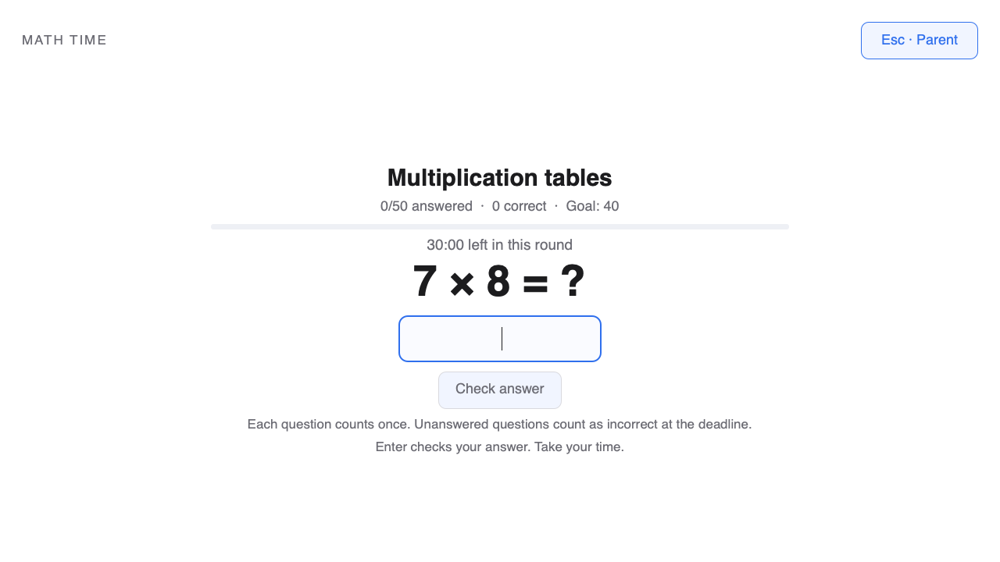

# Math Time

A full-screen multiplication challenge: **50 questions in 30 minutes, with 40 correct to pass**. If the score is lower, repeat **15-minute rounds of 25 questions, with 20 correct to pass**, until a round succeeds. Math Time has its own questions, timer, saved progress and parent-password override. It neither requires Screen Time nor earns, spends or changes screen-time minutes.

Works on regular **Omarchy Quattro with the Quickshell plugin system**. Plugin ID: **`io.github.peterholko.math`**. Version 1.1 adds timed, scored rounds to the standalone plugin.



## How practice works

| Round | Time | Questions | Correct answers needed |
| --- | --- | --- | --- |
| First round | 30 minutes | 50 | At least 40 |
| Every follow-up | 15 minutes | 25 | At least 20 |

- Multiplication tables **1–12**, shuffled across all 144 facts. Every fact appears before the deck repeats, including across follow-up rounds.
- Each question is scored on its **first valid answer** and then advances. Incorrect answers show the correct fact. Corrections and duplicate submissions cannot earn extra points.
- Each round lasts its full time. After the question quota is reached, the score stays visible until the timer ends; the app does not ask more questions in that round. Unanswered questions count as incorrect at the deadline.
- At the deadline, a passing score finishes practice. Otherwise, a fresh 15-minute, 25-question round begins. Its score starts at zero and needs 20 correct; this repeats until a round passes. Previous rounds’ scores do not carry over.
- The default is **one practice session per day**, starting on an unlocked desktop. A session can include several rounds. Finishing it ends the requirement for that day.
- Time counts while the practice screen is present on the active, unlocked desktop. Leaving every question unanswered can never pass a round. Parent-password entry, School Mode, locking, suspending and closing the shell pause the clock.
- Root-owned progress preserves the current round, question, score and remaining time across logout or reboot. Offline time does not count. Crossing midnight does not reset an unfinished round; finishing an overnight session satisfies the day it ends.
- Escape and the close action open a **parent-password prompt** during required practice. The laptop’s parent/root password can end the session early, including a follow-up; checking and failure feedback are visible. There is no separate PIN or Screen Time account.
- If the standalone **School Mode** service is present, practice is deferred or paused throughout School Mode and resumes in Free Time. An unavailable status for a known school enrollment also pauses practice. Installing School Mode is optional.

The overlay covers every connected display and takes keyboard focus. This is a practice requirement within an enabled Omarchy shell plugin, not an OS security boundary: someone with administrator access or permission to disable the plugin can bypass its display. Do not remove the parent’s administrative access.

## Install for Linnea

Run from Linnea’s desktop terminal. Only the explicit service setup uses `sudo`; it installs this plugin’s local service and enrolls `linnea`.

```bash
omarchy pkg add python &&
omarchy plugin add https://github.com/peterholko/omarchy-math-time --yes &&
sudo "$HOME/.config/omarchy/plugins/io.github.peterholko.math/setup" --user linnea &&
omarchy plugin enable io.github.peterholko.math
```

Enabling the plugin starts today’s practice immediately when Free Time is active. No logout or supplementary-group refresh is needed. If Math Time is already installed, use the update instructions below.

The parent override authenticates the existing root password through PAM. On a standard installation without a usable root password, an administrator should set the parent/root password with `sudo passwd root` before enrolling the child. Setup never changes any system password.

### Optional app launcher

```bash
mkdir -p "$HOME/.local/share/applications"
install -m 644 \
  "$HOME/.config/omarchy/plugins/io.github.peterholko.math/io.github.peterholko.math.desktop" \
  "$HOME/.local/share/applications/io.github.peterholko.math.desktop"
```

The unique launcher ID does not replace the built-in `omarchy.math` plugin. An approved-app policy may also need to allow `io.github.peterholko.math` to show the launcher; automatic practice does not depend on the launcher.

Open it directly with:

```bash
omarchy-shell shell summon io.github.peterholko.math '{}'
```

### Choose when practice starts

Setup defaults to `daily`. An administrator can change the trigger at any time without resetting an unfinished session:

```bash
sudo "$HOME/.config/omarchy/plugins/io.github.peterholko.math/setup" --user linnea --trigger daily
```

| Trigger | Behavior |
| --- | --- |
| `daily` | One practice session per calendar day, automatically when the desktop is available; follow-up rounds continue until passed. |
| `unlock` | A new session after each login/unlock; an unfinished session resumes instead of resetting. |
| `manual` | Open Math Time and choose Start. Once started, practice remains required until completed or ended by a parent. |

All three triggers pause during School Mode. Every session uses the same initial 30-minute round and repeating 15-minute follow-up rules.

## Update

Update both the shell plugin and its installed service. Trigger settings and version 1.1 round progress are retained. An unfinished version 1.0 session starts a fresh 50-question round, because the old timer did not record first-answer scores; days already completed or ended by a parent stay completed. This also upgrades the earlier 0.2 plugin.

```bash
omarchy plugin update io.github.peterholko.math --yes &&
sudo "$HOME/.config/omarchy/plugins/io.github.peterholko.math/setup" --user linnea --upgrade &&
omarchy plugin enable io.github.peterholko.math &&
omarchy restart shell
```

Setup refuses to overwrite untracked or locally modified system files. It does not alter the Screen Time, School Mode, games or Omarchy Kids services.

## Service and troubleshooting

The service uses Python 3’s standard library, systemd/logind and the system PAM library. The UI uses the Quickshell/Qt Quick runtime supplied by Omarchy; PySide6 is only needed for development tests.

- Service: `peterholko-math-time.service`.
- Root-owned settings: `/etc/peterholko-math-time/config.json`.
- Root-owned progress: `/var/lib/peterholko-math-time/practice.json`.
- Local socket: `/run/peterholko-math-time/sock`. Linux peer credentials restrict each account to its own enrollment. Parent authorization is verified separately through PAM.
- Passwords travel over the local socket/stdin, never command arguments, environment variables or saved practice data.

Check from the enrolled account:

```bash
omarchy-math-time-client status
systemctl status peterholko-math-time.service --no-pager
sudo journalctl -u peterholko-math-time.service -b --no-pager -n 40
```

If the app reports that the account is not enrolled, rerun setup with its actual username. If an active session loses the service connection, the view retains the requirement and reconnects automatically. Restarting the service or shell does not reset saved progress.

## Remove

An administrator can disable the shell plugin before removing its service enrollment. With other enrolled users, their service remains installed. With the last enrollment removed, setup removes only this plugin’s tracked service files; practice history is retained.

```bash
omarchy plugin disable io.github.peterholko.math
sudo "$HOME/.config/omarchy/plugins/io.github.peterholko.math/setup" --user linnea --remove
rm -f "$HOME/.local/share/applications/io.github.peterholko.math.desktop"
omarchy plugin remove io.github.peterholko.math
```

## Development and validation

Run local tests in a Python environment with PySide6:

```bash
python3 -m unittest discover -s tests -v
python3 tests/capture_ui.py /tmp/math-time-previews
omarchy plugin validate .
```

Tests cover the 40/50 and 20/25 thresholds, full round durations, repeated follow-ups, unanswered questions, deadline boundaries, all table facts, incorrect/replayed answers, pause/resume, reboot and version 1.0 migration, scheduling, School Mode, parent authentication decisions, the Unix-socket client, and the actual QML controller/service. The portable UI tests replace only the Quickshell process/display adapters; inspect the resulting screenshots as well. Linux PAM, systemd installation and compositor focus still need a smoke test on an Omarchy laptop. No GitHub Actions or paid CI is used.

## License

MIT. See [LICENSE](LICENSE), [ATTRIBUTION.md](ATTRIBUTION.md) and [SOURCE.json](SOURCE.json) for retained notices and source provenance.
