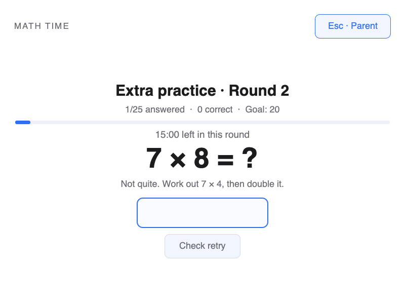

# Math Time

A manually started, full-screen multiplication app: **50 questions in 30 minutes, with 40 correct to pass**. Open **Math Time** from the app launcher and choose **Start 50-question round**. If the score is lower, repeat **15-minute rounds of 25 questions, with 20 correct to pass**, until a round succeeds. Math Time has its own questions, timer, saved progress and parent-password override. It neither requires Screen Time nor earns, spends or changes screen-time minutes.

Works on regular **Omarchy Quattro with the Quickshell plugin system**. Plugin ID: **`io.github.peterholko.math`**. Version 1.3 makes all sessions manual, including existing installations previously configured for daily or login/unlock starts.


## How practice works

| Round | Time | Questions | Correct answers needed |
| --- | --- | --- | --- |
| First round | 30 minutes | 50 | At least 40 |
| Every follow-up | 15 minutes | 25 | At least 20 |

- Multiplication tables **1–12**, shuffled across all 144 facts. Every fact appears before the deck repeats, including across follow-up rounds.
- Each question is scored on its **first valid answer**. A correct answer advances. An incorrect answer stays on screen with a strategy hint and **one unscored retry**.
- If the retry is correct, the app confirms it and advances. If it is still incorrect, the app shows the correct equation and waits for **Continue** (or Enter). The original score stays unchanged in either case; retries are part of the same question and do not use another slot in the 50- or 25-question quota.
- Each round lasts its full time. After the question quota and any final retry/review are finished, the score stays visible until the timer ends; the app does not ask more questions in that round. Unanswered questions count as incorrect at the deadline.
- The timer keeps running during hints and answer review. At the deadline, a passing score finishes practice. Otherwise, a fresh 15-minute, 25-question round begins. Its score starts at zero and needs 20 correct; this repeats until a round passes. Previous rounds’ scores do not carry over.
- **Every new session starts manually.** Booting, logging in, unlocking, changing the date or returning to Free Time never opens Math Time or starts a session. Open the app and choose Start when it is time to practise.
- After passing or a parent ending a session, open Math Time and choose **Start another session** to begin a fresh round, including on the same day. The previous result never blocks a new manual start.
- Time counts while the practice screen is present on the active, unlocked desktop. Leaving every question unanswered can never pass a round. Parent-password entry, School Mode, locking, suspending and closing the shell pause the clock.
- Root-owned progress preserves the current round, question, retry/review step, score and remaining time across logout or reboot. Open Math Time again to resume unfinished work. Offline time does not count, and crossing midnight does not reset a round.
- Escape and the close action open a **parent-password prompt** during required practice. The laptop’s parent/root password can end the session early, including a follow-up; checking and failure feedback are visible. There is no separate PIN or Screen Time account.
- If the standalone **School Mode** service is present, practice is unavailable throughout School Mode. Open Math Time again in Free Time to resume. An unavailable status for a known school enrollment also pauses practice. Installing School Mode is optional.

### Example of a guided retry

For **7 × 8**, an incorrect first answer gets the hint **“Work out 7 × 4, then double it.”** The answer remains hidden while the child tries once more. If that retry is also incorrect, the app reveals **7 × 8 = 56** and waits for Continue. Only the first answer contributes to the round’s passing score.



The overlay covers every connected display and takes keyboard focus. This is a practice requirement within an enabled Omarchy shell plugin, not an OS security boundary: someone with administrator access or permission to disable the plugin can bypass its display. Do not remove the parent’s administrative access.

## Install for Linnea

Run from Linnea’s desktop terminal. Only the explicit service setup uses `sudo`; it installs this plugin’s local service and enrolls `linnea`.

```bash
omarchy pkg add python &&
omarchy plugin add https://github.com/peterholko/omarchy-math-time --yes &&
sudo "$HOME/.config/omarchy/plugins/io.github.peterholko.math/setup" --user linnea &&
mkdir -p "$HOME/.local/share/applications" &&
install -m 644 \
  "$HOME/.config/omarchy/plugins/io.github.peterholko.math/io.github.peterholko.math.desktop" \
  "$HOME/.local/share/applications/io.github.peterholko.math.desktop" &&
omarchy plugin enable io.github.peterholko.math
```

After installation, open **Math Time** from the app launcher and choose **Start 50-question round** in Free Time. Enabling the plugin does not open the app or begin practice. No logout or supplementary-group refresh is needed. If Math Time is already installed, use the update instructions below.

The parent override authenticates the existing root password through PAM. On a standard installation without a usable root password, an administrator should set the parent/root password with `sudo passwd root` before enrolling the child. Setup never changes any system password.

### App launcher

The install and update commands add Math Time to the app launcher. If it was installed using the earlier instructions, add its entry from the desktop account:

```bash
mkdir -p "$HOME/.local/share/applications"
install -m 644 \
  "$HOME/.config/omarchy/plugins/io.github.peterholko.math/io.github.peterholko.math.desktop" \
  "$HOME/.local/share/applications/io.github.peterholko.math.desktop"
```

The unique launcher ID does not replace the built-in `omarchy.math` plugin. With the separate [School / Free Time plugin](https://github.com/peterholko/omarchy-school-mode), version 1.1.2 or later allows Math Time in Free Time's launcher. If that plugin is installed, update its approved-app list and restart the shell:

```bash
omarchy plugin update io.github.peterholko.school-mode --yes &&
omarchy restart shell
```

Math Time remains paused during School Mode. The launcher opens its own practice screen; an unfinished session resumes when you open it again.

Open it directly with:

```bash
omarchy-shell shell summon io.github.peterholko.math '{}'
```

### Start or resume a session

Open **Math Time** from the launcher, or use the command above. Choose **Start 50-question round** for a new session or **Start another session** after a previous result. If a session is unfinished, reopening the app resumes it without resetting its score or timer. Once started, it must be completed or ended with the parent password before returning to the desktop normally.

All sessions use the same initial 30-minute round and repeating 15-minute follow-up rules. Daily and login/unlock triggers have been removed; `setup --trigger manual` remains accepted for compatibility with earlier installation commands.

## Update

Update both the shell plugin and its installed service. Version 1.3 changes every enrollment to manual start while preserving version 1.1/1.2 questions, scores and remaining time. An unfinished version 1.0 session starts a fresh 50-question round, because the old timer did not record first-answer scores. Previous completed or parent-ended results are retained, with **Start another session** available. This also upgrades the earlier 0.2 plugin.

```bash
omarchy plugin update io.github.peterholko.math --yes &&
sudo "$HOME/.config/omarchy/plugins/io.github.peterholko.math/setup" --user linnea --upgrade &&
mkdir -p "$HOME/.local/share/applications" &&
install -m 644 \
  "$HOME/.config/omarchy/plugins/io.github.peterholko.math/io.github.peterholko.math.desktop" \
  "$HOME/.local/share/applications/io.github.peterholko.math.desktop" &&
omarchy plugin enable io.github.peterholko.math &&
omarchy restart shell
```

Setup refuses to overwrite untracked or locally modified system files. It does not alter the Screen Time, School Mode, games or Omarchy Kids services.

## Service and troubleshooting

The service uses Python 3’s standard library, systemd/logind and the system PAM library. The UI uses the Quickshell/Qt Quick runtime supplied by Omarchy; PySide6 is only needed for development tests.

- Service: `peterholko-math-time.service`.
- Root-owned settings: `/etc/peterholko-math-time/config.json`.
- Root-owned progress: `/var/lib/peterholko-math-time/practice.json`.
- Local socket: `/run/peterholko-math-time/sock`. Linux peer credentials restrict each account to its own enrollment. Parent authorization is verified separately through PAM.
- Passwords travel over the local socket/stdin, never command arguments, environment variables or saved practice data.

Check from the enrolled account:

```bash
omarchy-math-time-client status
systemctl status peterholko-math-time.service --no-pager
sudo journalctl -u peterholko-math-time.service -b --no-pager -n 40
```

If the app reports that the account is not enrolled, rerun setup with its actual username. If an active session loses the service connection, the view retains the requirement and reconnects automatically. Restarting the service or shell does not reset saved progress; launch Math Time again to resume. A previous parent-ended result can be followed by **Start another session**, without editing or deleting saved state.

## Remove

An administrator can disable the shell plugin before removing its service enrollment. With other enrolled users, their service remains installed. With the last enrollment removed, setup removes only this plugin’s tracked service files; practice history is retained.

```bash
omarchy plugin disable io.github.peterholko.math
sudo "$HOME/.config/omarchy/plugins/io.github.peterholko.math/setup" --user linnea --remove
rm -f "$HOME/.local/share/applications/io.github.peterholko.math.desktop"
omarchy plugin remove io.github.peterholko.math
```

## Development and validation

Run local tests in a Python environment with PySide6:

```bash
python3 -m unittest discover -s tests -v
python3 tests/capture_ui.py /tmp/math-time-previews
omarchy plugin validate .
```

Tests cover the 40/50 and 20/25 thresholds, full round durations, repeated follow-ups, unanswered questions, deadline boundaries, all table facts, guided retries, answer acknowledgement, first-answer scoring, incorrect/replayed answers, pause/resume, reboot and version 1.0 migration, scheduling, School Mode, parent authentication decisions, the Unix-socket client, and the actual QML controller/service. The portable UI tests replace only the Quickshell process/display adapters; inspect the resulting screenshots as well. Linux PAM, systemd installation and compositor focus still need a smoke test on an Omarchy laptop. No GitHub Actions or paid CI is used.

## License

MIT. See [LICENSE](LICENSE), [ATTRIBUTION.md](ATTRIBUTION.md) and [SOURCE.json](SOURCE.json) for retained notices and source provenance.
